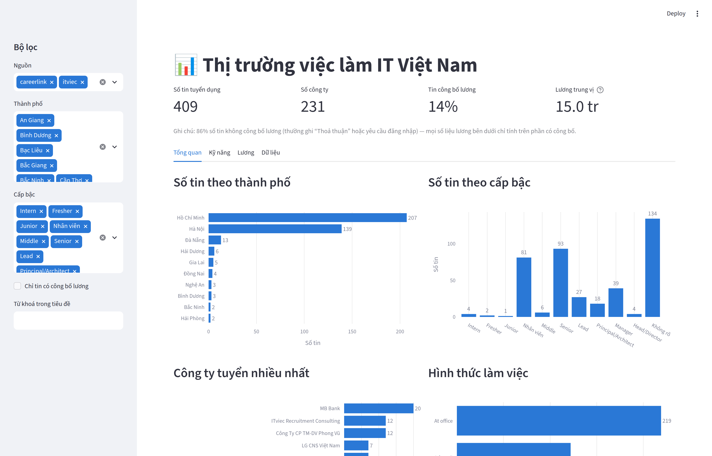
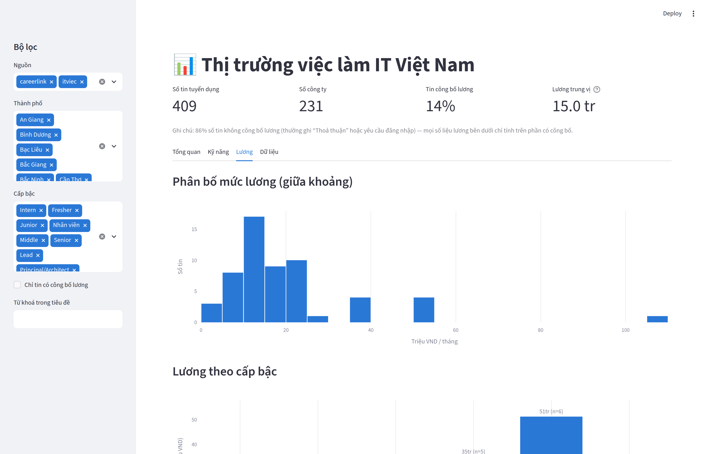
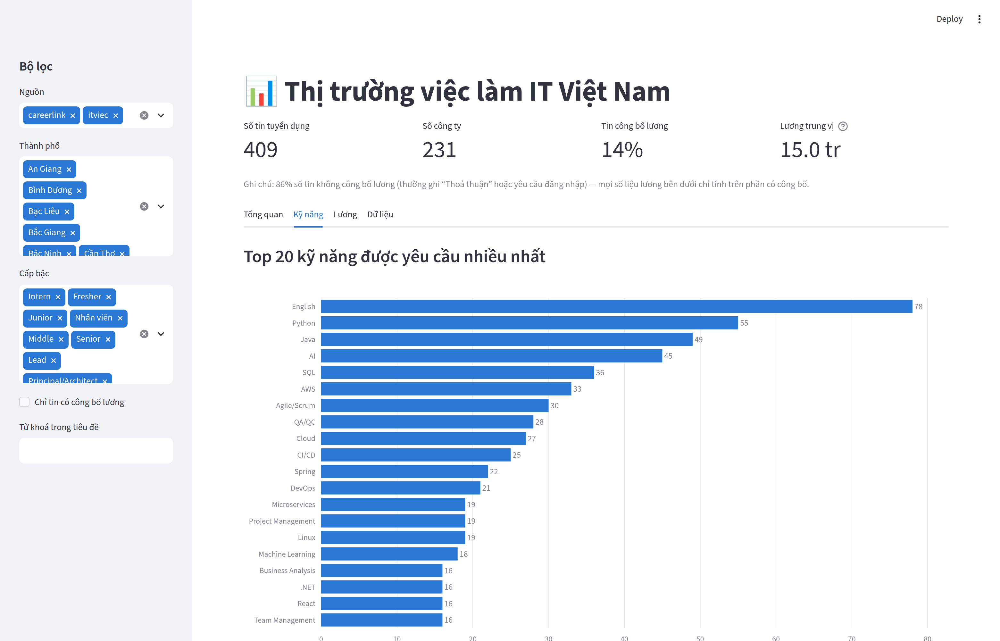

# IT Jobs Pipeline — thu thập, làm sạch & phân tích tin tuyển dụng IT Việt Nam

Pipeline dữ liệu end-to-end: **crawl → làm sạch → SQLite → dashboard Streamlit**.
Thu thập tin tuyển dụng IT từ ITviec và CareerLink để trả lời: kỹ năng nào đang được tuyển nhiều nhất,
mức lương theo cấp bậc ra sao, thị trường tập trung ở đâu.

**Dashboard trực tuyến:** [it-jobs-pipeline-vn.streamlit.app](https://it-jobs-pipeline-vn.streamlit.app)



## Kết quả (dữ liệu ngày 08/09/2026)

| | |
|---|---|
| Tin tuyển dụng thu thập | **409** |
| Công ty | **231** |
| Nguồn | ITviec (287 tin) + CareerLink (122 tin) |
| Tin công bố lương | 57 (14%) |
| Lương trung vị (chỉ tin công bố) | **15,0 triệu**/tháng, khoảng tứ phân vị 10,0 – 22,5 |

### Năm điều rút ra được

**1. 86% tin tuyển dụng IT không công bố lương.** Đây tự nó đã là một phát hiện, và nó chia đôi
thị trường rất rõ: ITviec ẩn lương **100%** số tin (yêu cầu đăng nhập mới xem được), trong khi
CareerLink công bố **47%**. Với người tìm việc, điều này nghĩa là khảo sát lương từ tin đăng luôn
lệch về nhóm chịu công khai — thường là công ty vừa và nhỏ.

**2. Lương tăng mạnh theo cấp bậc, nhưng cỡ mẫu còn nhỏ:**

| Cấp bậc | Lương trung vị | n |
|---|---|---|
| Intern | 3,0 triệu | 2 |
| Nhân viên | 11,0 triệu | 37 |
| Senior | 31,2 triệu | 2 |
| Lead | 35,0 triệu | 5 |
| Manager | 51,2 triệu | 6 |

Chỉ mức "Nhân viên" (n=37) là đủ tin cậy. Bốn mức còn lại có n ≤ 6 — ghi ở đây để tham khảo,
**không đủ để kết luận** về thị trường. Đây là lý do dashboard hiển thị `n` cạnh mọi số liệu lương
và ẩn những nhóm dưới 3 quan sát.

**3. Tiếng Anh được nhắc tới nhiều hơn mọi ngôn ngữ lập trình.** Trong 287 tin có gắn tag kỹ năng:

| Kỹ năng | Số tin | Tỷ lệ |
|---|---|---|
| English | 78 | 27% |
| Python | 55 | 19% |
| Java | 49 | 17% |
| AI | 45 | 16% |
| SQL | 36 | 13% |
| AWS | 33 | 11% |

**4. Thị trường tập trung tuyệt đối ở hai thành phố.** Hồ Chí Minh (207) và Hà Nội (139) chiếm
**85%** tổng số tin; Đà Nẵng thứ ba với 13 tin.

**5. Làm việc tại văn phòng vẫn áp đảo.** Trong số tin có ghi hình thức: At office 219, Hybrid 58,
Remote 10 — tức remote thuần chỉ chiếm 3,5%.



## Kiến trúc

```
              ┌──────────────┐      ┌───────────────┐      ┌──────────────┐
  Web  ─────► │  src/crawl   │ ───► │   src/clean   │ ───► │  src/store   │ ──► SQLite
              │  (scraper)   │ JSONL│ (chuẩn hoá)   │ tidy │  (upsert)    │
              └──────────────┘      └───────────────┘      └──────────────┘
                                                                  │
                                                                  ▼
                                                        dashboard/app.py (Streamlit)
```

Ranh giới giữa các tầng là **dữ liệu trên đĩa**, không phải lời gọi hàm. Nhờ vậy mỗi tầng chạy lại
độc lập được: sửa parser thì chạy lại từ HTML đã lưu, sửa logic làm sạch thì chạy lại từ file raw —
không lần nào phải đụng tới mạng.

| Thư mục | Vai trò |
|---|---|
| `src/crawl/` | Scraper theo nguồn (`itviec.py`, `careerlink.py`) + HTTP client có retry & rate limit |
| `src/clean/` | Chuẩn hoá lương, địa điểm, kỹ năng, cấp bậc; khử & gộp trùng lặp |
| `src/store/` | Lược đồ SQLite + ghi dữ liệu idempotent |
| `dashboard/` | Ứng dụng Streamlit |
| `tests/` | 33 test chạy offline bằng fixture HTML thật |

## Cài đặt & chạy

```bash
python -m venv .venv
.venv\Scripts\activate          # Windows
pip install -r requirements.txt

python run_pipeline.py                       # crawl mọi nguồn đang bật
python run_pipeline.py --sources careerlink  # chỉ một nguồn
python run_pipeline.py --from-raw  data/raw/jobs_20260908_133752.jsonl   # làm sạch lại
python run_pipeline.py --from-html data/raw/html_20260908_133752         # bóc tách lại

streamlit run dashboard/app.py
pytest -q
```

## Chạy tự động hằng ngày

`scripts/run_daily.bat` crawl cả hai nguồn rồi xuất lại bản chụp dữ liệu. Đăng ký với Windows
Task Scheduler để dữ liệu tự tích luỹ:

1. Mở **Task Scheduler** → *Create Basic Task*
2. Trigger: **Daily**, chọn giờ thấp điểm (ví dụ 07:00)
3. Action: *Start a program* → trỏ tới `scripts\run_daily.bat`
4. Trong tab *General*, tick **Run whether user is logged on or not**

Mỗi lần chạy chỉ cập nhật `last_seen_at` của tin đã có và thêm tin mới (ghi idempotent), nên chạy
lại bao nhiêu lần cũng an toàn. Sau vài tuần, cặp `first_seen_at`/`last_seen_at` đủ để phân tích
vòng đời tin tuyển dụng — thứ không trang nào công bố sẵn.

## Dashboard công khai

Dashboard deploy trên Streamlit Community Cloud đọc **bản chụp dữ liệu** trong
`data/snapshot/jobs_snapshot.csv` (157 KB) thay vì CSDL SQLite, vì thư mục `data/` không được đưa
lên Git. Ứng dụng tự chọn nguồn: có CSDL cục bộ thì dùng CSDL, không thì quay về bản chụp và hiển
thị rõ ngày chụp để người xem không nhầm là dữ liệu thời gian thực.

Cập nhật bản chụp: `python scripts/export_snapshot.py` rồi commit.

## Những quyết định kỹ thuật đáng chú ý

**1. Chọn nguồn bằng thực nghiệm, và tôn trọng khi bị từ chối.**
TopCV và JobsGO trả **403 Forbidden** với cả bốn cấu hình request (trơn, User-Agent, bộ header
trình duyệt đầy đủ, Session lấy cookie trước). Đó là câu trả lời rõ ràng rằng họ không muốn bị
thu thập tự động, nên tôi chuyển sang nguồn khác thay vì tìm cách vượt qua. Quy trình sàng lọc
mỗi nguồn: đọc `robots.txt` → thử tải với header đầy đủ → kiểm tra lương có nằm trong HTML thô
hay do JavaScript dựng lên.

**2. Parser neo vào cấu trúc bền, không neo vào tên class CSS.**
Class là thứ front-end đổi bất cứ lúc nào, và khi đổi thì crawler trả về danh sách rỗng mà không
báo lỗi — hỏng âm thầm còn tệ hơn hỏng ồn ào. Ở đây neo vào dạng URL của tin
(`/it-jobs/<slug>-<id>`, `/tim-viec-lam/<slug>/<id>`), quan hệ cha–con trong DOM, và tham số truy
vấn đặc trưng (`?click_source=Skill+tag` của ITviec đánh dấu chính xác thẻ kỹ năng).

**3. Luôn kiểm chứng trên HTML thô, không trên DOM của trình duyệt.**
Hai bug thật gặp phải: thẻ tin CareerLink là `<li>` chứ không phải `<div>` (selector `div.job-item`
cho ra 0 kết quả), và thời gian cập nhật trong HTML thô chỉ có `data-datetime="1788848319"` —
dòng chữ "2 giờ trước" do JavaScript điền. Crawler chỉ nhìn thấy HTML thô.

**4. Lương là bài toán chính của khâu làm sạch.**
Dữ liệu thật viết đủ kiểu: `Thoả thuận`, `Thương lượng`, `Sign in to view salary`, `$1,000 - $2,000`,
`Tới 1,500 USD`, `20 triệu - 22 triệu`, `Trên 20 triệu`. Tất cả quy về
`(min, max, currency, disclosed)` theo VND. Quan trọng nhất: **"không công bố" khác "bằng 0"** —
gán 0 cho tin ẩn lương sẽ kéo mọi thống kê xuống một nửa.

**5. Không trộn hai hệ quy chiếu cấp bậc.**
CareerLink gán nhãn "Nhân viên", ITviec dùng "Middle Developer" — hai thang khác nhau, nên giữ
riêng thay vì ép về cùng một mức. Cấp bậc ưu tiên lấy từ nhãn do chính trang tuyển dụng gắn,
chỉ suy đoán từ tiêu đề khi không có nhãn.

**6. Trùng lặp giữa các nguồn thì gộp, không vứt.**
Một tin đăng ở hai nơi: nguồn này có lương, nguồn kia có tag kỹ năng. `_merge_group` giữ bản đầy đủ
nhất rồi bù ô trống và hợp nhất danh sách kỹ năng từ các bản còn lại.

**7. Tầng raw ghi theo dòng (JSONL), không gom vào RAM.**
Mỗi tin ghi xuống đĩa ngay khi lấy được. Crawler chết ở tin thứ 900 thì 899 tin trước vẫn còn —
với file JSON thường (phải đóng bằng `]`) thì file cụt là file hỏng.

**8. Ghi CSDL idempotent.**
Chạy lại bao nhiêu lần cũng chỉ một bản ghi mỗi tin, chỉ cập nhật `last_seen_at`. Cặp
`first_seen_at`/`last_seen_at` cho biết tin còn sống hay đã bị gỡ — dữ liệu không có sẵn ở bất kỳ
đâu trên web, chỉ sinh ra từ việc chạy pipeline đều đặn.

**9. Bẫy Unicode tiếng Việt.**
`unicodedata.normalize("NFD", ...)` **không** tách được dấu của chữ `Đ`/`đ` (ký tự riêng, không phải
`D` + dấu). Không xử lý riêng thì "Đà Nẵng" không bao giờ khớp "da nang" và toàn bộ tin ở Đà Nẵng
biến mất khỏi thống kê mà không có một dòng lỗi nào.



## Hạn chế đã biết

- **Cỡ mẫu lương nhỏ** (n=57). Mọi con số lương theo cấp bậc ngoài mức "Nhân viên" chỉ mang tính
  tham khảo. Cách khắc phục: chạy pipeline định kỳ để tích luỹ.
- **Chỉ một lát cắt thời gian.** Dữ liệu hiện là ảnh chụp ngày 08/09/2026; phần phân tích xu hướng
  cần vài tuần dữ liệu tích luỹ.
- **33% tin không xác định được cấp bậc** — chủ yếu là tiêu đề ITviec không chứa từ khoá cấp bậc.
- **CareerLink lọc theo từ khoá chứ không theo ngành**, nên phải lọc tin ngoài ngành IT bằng danh
  sách từ khoá (`_looks_like_it_job`). Cách này bỏ sót và nhận nhầm ở mức nhất định.
- Chỉ crawl trang danh sách công khai, có nghỉ giữa các request, tôn trọng `robots.txt`; dữ liệu
  dùng cho mục đích học tập và phân tích cá nhân.

## Hướng phát triển

- Chạy định kỳ hằng ngày để có chuỗi thời gian: vòng đời tin tuyển dụng, xu hướng kỹ năng theo tuần.
- Trích kỹ năng từ mô tả công việc bằng NLP thay vì chỉ dựa vào tag có sẵn.
- Dự đoán khoảng lương cho tin ghi "Thoả thuận" từ tiêu đề + kỹ năng + công ty.
- Thêm nguồn: chỉ cần một file trong `src/crawl/` và một dòng đăng ký vào `SCRAPERS`.
